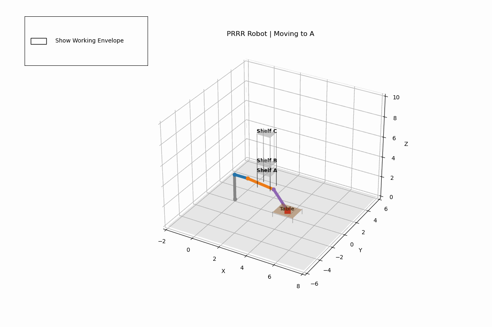
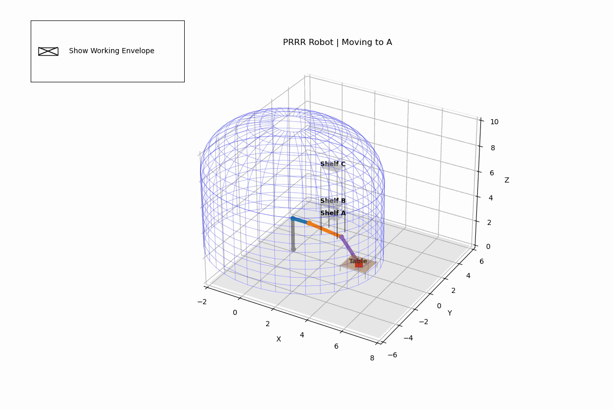
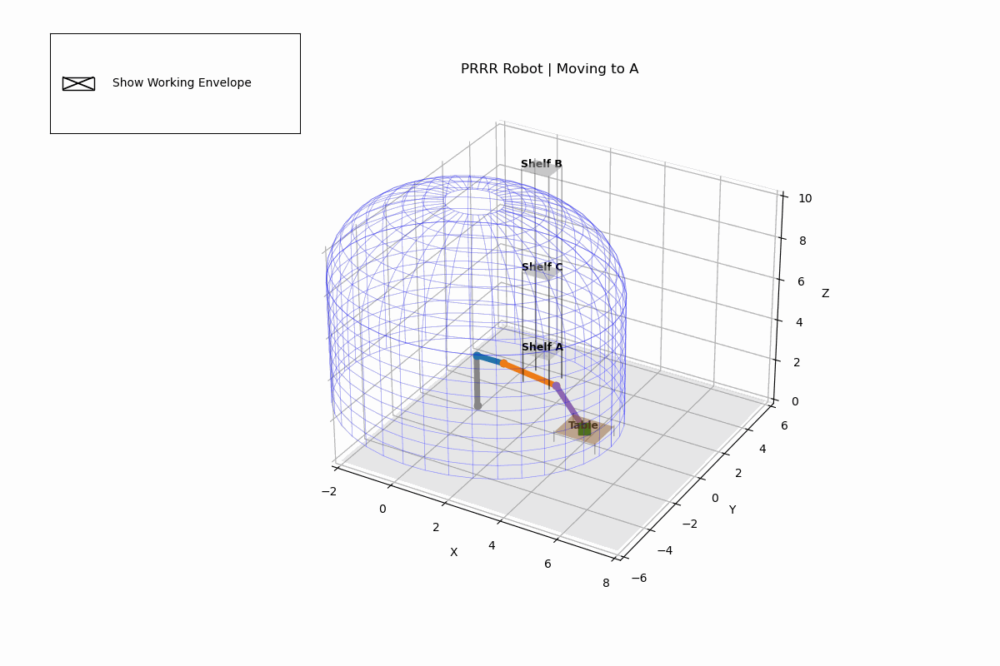

# 4-DOF PRRR Robot Manipulation Simulation

**Author:** Aman Mishra  
**Module:** PDE 4431 Robot Manipulation  
**Date:** December 2025

## Overview

This project simulates a **Prismatic-Revolute-Revolute-Revolute (PRRR)** robot manipulator for a pick-and-place task.
The robot is designed to pick boxes from a table and place them onto shelves of varying heights.

## Kinematics

The robot uses the Denavit-Hartenberg (DH) convention.

### Configuration

- **Joint 1 (Prismatic):** Vertical Lift ($d_1$)
- **Joint 2 (Revolute):** Turret Rotation ($\theta_2$)
- **Joint 3 (Revolute):** Shoulder Pitch ($\theta_3$)
- **Joint 4 (Revolute):** Elbow/Wrist Pitch ($\theta_4$)

### DH Table

| Link ($i$) |  $a_i$ (Length)  | $\alpha_i$ (Twist) | $d_i$ (Offset) | $\theta_i$ (Angle) |
| :--------: | :--------------: | :----------------: | :------------: | :----------------: |
|     1      |        0         |         0          |    $d_1^*$     |         0          |
|     2      | $L_{base}$ (1.0) |      -90&deg;      |       0        |    $\theta_2^*$    |
|     3      | $L_{arm1}$ (2.0) |         0          |       0        |    $\theta_3^*$    |
|     4      | $L_{arm2}$ (2.0) |         0          |       0        |    $\theta_4^*$    |

## Features

1. **Inverse Kinematics (IK) Solver:** - Uses numerical optimization (`scipy.optimize.minimize`) to solve for joint angles given a target $(x, y, z)$.
   - **Why Minimize?** Numerical optimization was chosen over analytical methods (closed-form equations) because it offers greater flexibility. Instead of deriving complex geometric formulas for each joint, we define a 'cost function' that represents the error between the robot's current position and the target. The solver iteratively adjusts the joints to minimize this error to zero. This approach also allows us to easily inject constraints—like preventing the arm from hitting the floor—simply by adding penalties to the cost function, which would be very difficult to implement mathematically in a standard analytical solution.
   - **Floor Constraints:** Penalizes solutions where any joint dips below the ground plane ($z < 0$).
2. **Reachability Validation:** - Automatically checks if a target is reachable before attempting movement.
   - Skips targets outside the workspace to prevent solver errors.
3. **Interactive Visualization:**
   - 3D animation of the robot and boxes.
   - **Checkbox:** Toggle the visualization of the "Working Envelope" (blue wireframe dome).

## Usage

Run the script using Python:

```bash
python prrr_robot_envelope.py
```

## Dependencies

- `numpy`
- `matplotlib`
- `scipy`

## Demos


### 1. Standard Operation


In the above, the PRRR manipulator successfully picks and places 3 objects from the table and onto the shelf.

### 2. Working Envelope Visualization


Visualization of the working envelope of the manipulator shows a dome like reach at the top while a cylindrical
envelope around the main region within the Joint J1 prismatic range.

### 3. Reachability Check (Item Out of Bounds)


In this example, the manipulator skips the placement on Shelf B and proceeds to move object C from the table to
the Shelf C.

## Validation

For every point final point in space, there is a validation check that confirms whether the manipulator can reach the item within 5cm of the point. For this, the minimum of 0.05 was set as tolerance.

When all points are reachable, the following is output in the console

```
--- Validating Targets ---
Target Home: REACHABLE
Target A: REACHABLE
Target B: REACHABLE
Target C: REACHABLE

Generating Trajectory...
```

And for each unreachable point, the following is displayed

```
--- Validating Targets ---
Target Home: REACHABLE
Target A: REACHABLE
Target B: UNREACHABLE (Will skip)
Target C: REACHABLE

Generating Trajectory...
Skipping segment Home -> B due to unreachability.
Skipping segment B -> Home due to unreachability.
```
